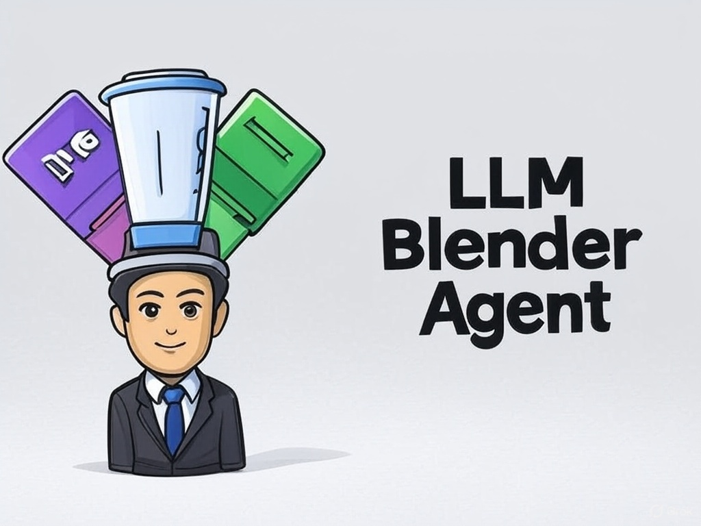

# LLM-Blender-Agent



This is a project that uses the Function Call capability of different Large Language Models (LLMs) to operate Blender. The project allows users to control Blender for 3D modeling using natural language through various LLM interfaces (such as Claude, Zhipu AI, DeepseekV3, AIMLAPI, etc.).


## Features

- Seamless switching between multiple LLM interfaces (Claude, Zhipu AI, DeepseekV3, AIMLAPI, etc.)
- Unified Function Call processing framework for all LLM providers
- Gradio Web UI interface for user-friendly interaction
- Complete support for all features provided by the BlenderMCP plugin:
  - Basic scene operations (create, modify, delete objects)
  - Material and texture management
  - Integration with Poly Haven resource library
  - Integration with Hyper3D Rodin AI model generation service
- Integration with Hunyuan3D-2 generator:
  - Generate 3D models from text descriptions
  - Generate 3D models from image references
  - Apply textures to existing mesh objects
  - Customizable generation parameters (resolution, inference steps, etc.)
- Natural language control of Blender for 3D modeling
- Multi-modal input support (text and images) depending on the LLM capabilities
- Easily extensible architecture, supporting the addition of new LLM providers

## Supported Models

-  Claude
-  Zhipu AI (GLM-4) (智谱AI)
-  DeepseekV3 (深度求索)
-  AIMLAPI (我能找到的最便宜的Claude api代理，如不能购买claude api)
-  Doubao (豆包)
-  Moonshot (Kimi) (月之暗面)

## Installation Requirements

```bash
# Install dependencies
pip install -r requirements.txt
```

Additionally, you need to install the BlenderMCP plugin in Blender and start the MCP server.

### Installing the Blender Plugin


1. Download the latest addon.py file
2. Open Blender and go to Edit > Preferences
3. Select Add-ons tab and click "Install..."
4. Browse to and select the addon.py file
5. Enable the plugin by checking the box next to "Interface: LLM Blender Agent"
6. The plugin should now appear in the sidebar (press N to show sidebar if hidden)

## Usage

### Gradio Web UI Mode

```bash
# Start the Web UI
python app.py
```

Then visit http://localhost:7860 in your browser

The Gradio Web UI offers the following features:
- Connection settings for Blender MCP
- LLM model selection and temperature control
- Text and image input for communicating with the LLM
- Chat history display
- Real-time interaction with Blender

### Hunyuan3D-2 Generator

The integrated Hunyuan3D-2 generator allows you to:
- Generate detailed 3D models from text descriptions
- Create 3D models based on reference images
- Apply textures to existing mesh objects
- Customize generation parameters:
  - Octree resolution (128-512)
  - Number of inference steps (20-50)
  - Guidance scale (1.0-10.0)
  - Texture generation options

Access these features through the Blender UI panel under View3D > Sidebar > BlenderMCP > Hunyuan3D-2 3D Generator.

##  Hunyuan3D-2 Integration

### About Hunyuan3D-2

Hunyuan3D-2 是腾讯开发的先进3D生成模型，可以通过文本或图像生成高质量3D模型，并支持对现有模型进行纹理贴图。我们将其集成到LLM-Blender-Agent中，使用户能直接在Blender界面中利用这一技术。

主要特性：
- 文本到3D模型生成
- 图像到3D模型生成
- 为现有网格对象应用纹理
- 可配置的生成参数

### Installation Guide

要使用Hunyuan3D-2功能，您需要安装并配置Hunyuan3D-2服务器：

1. 克隆Hunyuan3D-2仓库
```bash
git clone https://github.com/Tencent/Hunyuan3D-2
```

2. 下载图像到3D模型权重
```bash
git lfs install  # 启用Git大文件存储
git clone https://huggingface.co/tencent/Hunyuan3D-2    # 115GB
# 可选轻量版本:
# git clone https://huggingface.co/tencent/Hunyuan3D-2mini    # 46GB
```

3. 下载文本到图像模型
```bash
git lfs install
git clone https://huggingface.co/Tencent-Hunyuan/HunyuanDiT-v1.2-Diffusers-Distilled    # 27GB
```

4. 配置环境
```bash
# 创建并激活conda环境(推荐)
conda create -n Hunyuan3D python=3.11
conda activate Hunyuan3D

# 从官方网站安装PyTorch
pip3 install torch torchvision torchaudio

# 安装依赖
pip install -r requirements.txt
pip install -e .

# 安装纹理组件
cd hy3dgen/texgen/custom_rasterizer
python3 setup.py install
cd ../../..
cd hy3dgen/texgen/differentiable_renderer
python3 setup.py install
```

5. 使用我们提供的API服务器文件
   将原始`api_server.py`替换为我们修改的版本`hunyuan/api_server.py`
   (官方服务器缺少文本到图像功能，新文件中标记为"TODO"的部分指示了需要替换的路径)

6. 启动服务器
```bash
python api_server.py
```

7. 在Blender中配置
   启动Blender后，在View3D > Sidebar > BlenderMCP > Hunyuan3D-2 3D Generator面板中设置API URL为您的服务器地址(默认为http://localhost:8080)

详细安装指南请参考`hunyuan/how-to-install-hunyuan.md`文件。

## LLM Configuration

Set your API keys and model configurations in the `config.json` file:

```json
{
  "claude": {
    "api_key": "YOUR_CLAUDE_API_KEY",
    "model": "claude-3-opus-20240229"
  },
  "zhipu": {
    "api_key": "YOUR_ZHIPU_API_KEY",
    "model": "glm-4"
  },
  "deepseek": {
    "api_key": "YOUR_DEEPSEEK_API_KEY",
    "model": "deepseek-v3"
  },
  "aimlapi": {
    "api_key": "YOUR_AIMLAPI_API_KEY",
    "model": "claude-3-7-sonnet-20250219"
  }
}
```

## Examples

Here are some example commands you can use with the Blender Agent:

### Creating a Simple Scene

```
Create a red cube at the center of the scene and a blue sphere at coordinates [2, 0, 0].
```

### Material Manipulation

```
Apply a glass material to the sphere and make the cube metallic with a roughness value of 0.2.
```

### Working with Poly Haven Assets

```
Find me a wooden floor texture from Poly Haven and apply it to a new plane object.
```

### Using Hyper3D Rodin for AI Model Generation

```
Generate a 3D model of a realistic tree using Rodin AI.
```

### Using Hunyuan3D-2 Generator

```
Generate a 3D model of a realistic car using Hunyuan3D-2.
```

```
Apply a photorealistic brick texture to this wall using Hunyuan3D-2.
```

## License

MIT License 