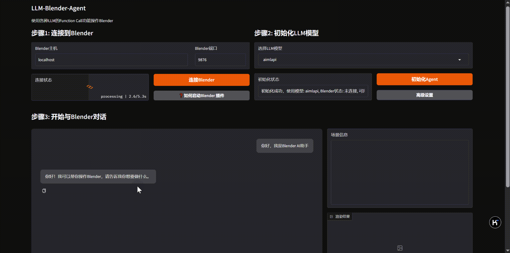

# LLM-Blender-Agent


This is a project that uses the Function Call capability of different Large Language Models (LLMs) to operate Blender. The project allows users to control Blender for 3D modeling using natural language through various LLM interfaces (such as Claude, Zhipu AI, DeepseekV3, AIMLAPI, etc.).



## Features

- Seamless switching between multiple LLM interfaces (Claude, Zhipu AI, DeepseekV3, AIMLAPI, etc.)
- Unified Function Call processing framework for all LLM providers
- Gradio Web UI interface for user-friendly interaction
- Complete support for all features provided by the BlenderMCP plugin:
  - Basic scene operations (create, modify, delete objects)
  - Material and texture management
  - Integration with Poly Haven resource library
  - Integration with Hyper3D Rodin AI model generation service
- Natural language control of Blender for 3D modeling
- Multi-modal input support (text and images) depending on the LLM capabilities
- Easily extensible architecture, supporting the addition of new LLM providers

## 支持的模型

-  Claude
-  Zhipu AI (GLM-4)
-  DeepseekV3
-  AIMLAPI
-  Doubao
-  Moonshot (Kimi)

## Installation Requirements

```bash
# Install dependencies
pip install -r requirements.txt
```

Additionally, you need to install the BlenderMCP plugin in Blender and start the MCP server.

## Usage

### Gradio Web UI Mode

```bash
# Start the Web UI
python app.py
```

Then visit http://localhost:7860 in your browser

The Gradio Web UI offers the following features:
- Connection settings for Blender MCP
- LLM model selection and temperature control
- Text and image input for communicating with the LLM
- Chat history display
- Real-time interaction with Blender

## LLM Configuration

Set your API keys and model configurations in the `config.json` file:

```json
{
  "claude": {
    "api_key": "YOUR_CLAUDE_API_KEY",
    "model": "claude-3-opus-20240229"
  },
  "zhipu": {
    "api_key": "YOUR_ZHIPU_API_KEY",
    "model": "glm-4"
  },
  "deepseek": {
    "api_key": "YOUR_DEEPSEEK_API_KEY",
    "model": "deepseek-v3"
  },
  "aimlapi": {
    "api_key": "YOUR_AIMLAPI_API_KEY",
    "model": "claude-3-7-sonnet-20250219"
  }
}
```

## Examples

Here are some example commands you can use with the Blender Agent:

### Creating a Simple Scene

```
Create a red cube at the center of the scene and a blue sphere at coordinates [2, 0, 0].
```

### Material Manipulation

```
Apply a glass material to the sphere and make the cube metallic with a roughness value of 0.2.
```

### Working with Poly Haven Assets

```
Find me a wooden floor texture from Poly Haven and apply it to a new plane object.
```

### Using Hyper3D Rodin for AI Model Generation

```
Generate a 3D model of a realistic tree using Rodin AI.
```

## License

MIT License 